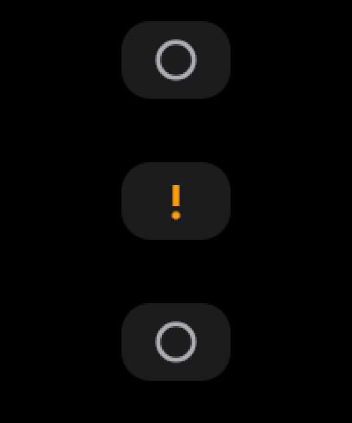

# voice_input

Ctrl + Space を押す → 話す → もう一度 Ctrl + Space → カーソル位置に文字が入る。

Windows / Ubuntu で動く、バックグラウンド常駐型の軽量音声入力ツールです。
Rust 製・WebView なし。待機中はマイクもネットワークも使いません。

```
Idle ──Ctrl+Space──▶ Recording ──Ctrl+Space──▶ Transcribing ──API成功──▶ Inserting ──▶ Idle
                          │                          │                       │
                          └──────── 失敗 ────────────┴──────── 失敗 ─────────┴──▶ Error ──数秒──▶ Idle
```

画面上部中央に小さな半透明のカプセルが 1 つ出ます。文字は出しません。



| 表示 | 状態 |
|------|------|
| ○    | Idle |
| ●（呼吸するように脈動・声量に反応） | Recording |
| •••  | Transcribing / Inserting |
| ✓（1.2 秒） | 挿入完了 |
| !    | Error（数秒で Idle に戻る） |

## セットアップ

```bash
# 1. ビルド
cargo build --release          # Linux は事前に: sudo apt install libasound2-dev

# 2. API キーを OS の資格情報ストアに保存（stdin から読むので履歴に残りません）
./target/release/voice_input --set-api-key

# 3. 起動（ターミナルで Ctrl+C か、カプセルをダブルクリックで終了）
./target/release/voice_input
```

API キーの探索順は **OS Credential Store → 環境変数 `OPENAI_API_KEY` → config.toml** です。
設定ファイルの場所は `voice_input --config-path` で表示されます。項目は
[`config.example.toml`](config.example.toml) を参照してください。

ログは `RUST_LOG=debug voice_input`。API キー・録音データ・文字起こし本文はどのレベルでもログに出しません。
録音はメモリ上だけで扱い、文字起こし後に破棄します。履歴は保存しません。
実行ログは起動時のカレントディレクトリ配下の `log\voice_input.log` にも追記されます（git 管理外）。

## 起動方法まとめ（Windows・最終形）

Windows では GUI アプリとしてビルドされるため、ラッパー（PowerShell / vbs / nohup）は不要です。

| やること | 方法 |
|----------|------|
| 起動 | `target\release\voice_input.exe` を実行（ダブルクリック可・コンソールは出ない） |
| 停止 | カプセルをダブルクリック（または `taskkill /F /IM voice_input.exe`） |
| サインイン時に自動起動 | `Win + R` → `shell:startup` に exe のショートカットを置く（解除は削除） |

補足:

- `config.toml` と `log\` は「カレント → exe の場所 → exe の 2 つ上（= リポジトリ直下）」の順で解決されるため、どこから起動しても同じ場所が使われます。
- CLI（`--help` / `--set-api-key` など）は従来どおりターミナルから使えます。
- 二重起動は不可（2 つ目は `!` 表示のまま）。起動に失敗したら `log\voice_input.log` を確認。

## プラットフォーム別の注意

### Windows
- ホットキー: `RegisterHotKey`、文字入力: `SendInput`（Unicode）。失敗時はクリップボード + Ctrl+V にフォールバックし、元のクリップボード内容を復元します。
- 追加インストールは不要です。

### Ubuntu (X11)
- ホットキー: `XGrabKey`。文字入力: `xdotool` があればそれで入力（ターミナルでも動作）、なければクリップボード + XTEST Ctrl+V。
  ```bash
  sudo apt install xdotool
  ```
- **IBus / Fcitx の既定のキー切替が Ctrl+Space の場合は競合します。** どちらかを変更してください（`hotkey = "Ctrl+Alt+Space"` など）。

### Ubuntu (Wayland / GNOME)
- ホットキー: XDG Desktop Portal の `GlobalShortcuts` を使います。初回起動時にショートカットの確認ダイアログが出ます（GNOME 46 以降 / KDE 6）。
- 文字入力: Wayland は他アプリへの入力注入を許可しないため、`wtype`（wlroots 系）→ `ydotool`（要 `ydotoold`）の順に試し、どちらも無ければ **クリップボードにコピーした上で Error 表示** にします（Ctrl+V で貼り付けできます）。
  ```bash
  sudo apt install ydotool && sudo systemctl enable --now ydotool
  ```
- オーバーレイの位置指定と最前面固定は Wayland のプロトコル上できないため、コンポジタの配置に従います。

## 設計

```
src/
  app/          state.rs（純粋な状態遷移）  controller.rs（Effect の実行）
  audio/        audio_data.rs（純粋な変換）  recorder.rs（cpal）
  transcription/provider.rs（trait）        openai.rs
  hotkey/       mod.rs（parse / debounce） windows.rs  linux.rs
  input/        mod.rs（trait）  windows.rs  x11.rs  wayland.rs  clipboard.rs
  ui/           state_view.rs（純粋な表示ロジック）  overlay.rs（eframe）
  config/       config.rs  credentials.rs
  platform/     判定と組み立て
  doubles.rs    Fake（Recorder / Provider / Injector / Overlay / CredentialStore）
```

- **Business Logic ≠ OS API ≠ UI ≠ Network。** 判断はすべて `app/` と `*_view` / `audio_data` の純粋なコードにあり、OS 依存部分は薄い Adapter（Humble Object）です。
- `StateMachine::handle(Event) -> Vec<Effect>` が中心。副作用は Controller が `Effect` を見て実行します。
- 白銀比 `1 : √2` を幅/高さ、角丸、グリフ、余白、脈動の最大倍率に用いています（`ui/state_view.rs::Layout`）。
- 将来: `TranscriptionProvider` を実装すれば Google / ローカル Whisper へ、`TextInjector` を実装すれば IBus へ差し替え可能です。

## 開発（t_wada 式 TDD）

Red → Green → Refactor を小さく回しています。コミット履歴がそのままサイクルの記録です。

```bash
cargo test                 # 66 テスト。マイク・ネットワーク・ディスプレイ不要
cargo clippy --all-targets -- -D warnings
cargo check --target x86_64-pc-windows-gnu   # Linux 上で Windows 向けに検証
```

最重要テストは `src/app/state.rs`（状態遷移）、`tests/controller.rs`（Fake で全体を通す）、`tests/hotkey.rs`（連打しても二重起動しない）にあります。

ホットキーが反応しないときの切り分け用に `cargo run --example hotkey_probe` があります（6 秒間 Ctrl+Space を待ち、押すたびに `TOGGLE` を表示）。
